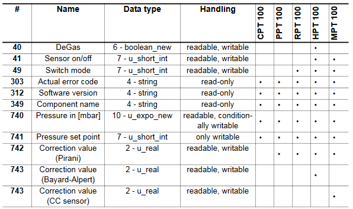

# Pfeiffer Vacuum Protocol

A python interface for controlling Pfeiffer vacuum gauges over RS485.

## Installation, Testing, and Dependencies
This library is available on pip.  Please install it with the following command.
```
pip install pfeiffer-vacuum-protocol
```
Testing is done with python's unit testing framework.  You can verify the current branch is working with the following command.
```
[cmpierce@turing dist]$ python -m unittest pfeiffer_vacuum_protocol.tests
...............................
----------------------------------------------------------------------
Ran 31 tests in 0.006s

OK
```
The only required dependency is your favourite serial library.  This package was developed and tested against `pySerial`.  However, it should be compatible with any library that implements python's IO interface.

## Description and Hardware Compatibility

This library was created to communicate with a Pfeiffer vacuum PPT 100 over its RS485 interface.  These gauges can be purchased cheaply from ebay and this library enables simple readout of pressure from the gauges through python.


To correctly do this, you'll need to make a quick custom cable for the device.  Please follow the pinout in the PPT 100 manual reproduced here.  On this particular gauge, V DC is 24 V.


Cheap RS485 adapters exist that allow the gauge to be directly connected to a PC.  Currently, only functions relevant to the PPT 100 are implemented in the library.  The following is a table of compatibility for other models reproduced from the PPT 100 manual.  If you are interested in other gauges, then please consider contributing.



## Quickstart Guide
The library is designed for and tested against the `pySerial` interface for communicating with the gauges.  However, because it can technically be used with any serial interface that implements python's IO interface, I have decided against imposing which library to use in the dependencies of this project.  To use pySerial as in this example, please installit through pip with `pip install pySerial`.

The most common operation is to read out pressure from the gauge.  The following example will read out pressure from a gauge attached to COM port 1 with address 1 on the RS485 network.  The pressure returned will be in bar.

```python
import serial
import pfeiffer_vacuum_protocol as pvp

# Open the serial port with a 1 second timeout
s = serial.Serial("COM1", timeout=1)

# Read the pressure from address 1 and print it
p = pvp.read_pressure(s, 1)
print("Pressure: {:.3f} bar".format(p))
```

## Package Reference

##### read_error_code(s, addr)

Reads Pfeiffer's low level error code on the gauge.  This appears to be useful for diagnosing failure of the transmitter itself.

###### Parameters

* s: pySerial object
      The open serial device attached to the gauge
* addr: int
      The address of the gauge

###### Returns

* error_code: pfeiffer_vacuum_protocol.ErrorCode enum element
      The error code returned by the gauge, this can be one of `NO_ERROR`, `DEFECTIVE_TRANSMITTER`,
      or `DEFECTIVE_MEMORY`

##### read_software_version(s, addr)

Returns the vacuum gauge's firmware version.

###### Parameters

* s: pySerial object
      The open serial device attached to the gauge
* addr: int
      The address of the gauge

###### Returns

* firmware_version: three element tuple if ints
     The version numbers as the tuple (major, minor, sub-minor)

##### read_gauge_type(s, addr)

Returns the name of the vacuum gauge attached at this address.

###### Parameters

* s: pySerial object
      The open serial device attached to the gauge
* addr: int
      The address of the gauge

###### Returns

* gauge_type: str
      The model name of the gauge attached

##### read_pressure(s, addr)

Reads the pressure from the gauge and returns it in bars.

###### Parameters

* s: pySerial object
      The open serial device attached to the gauge
* addr: int
      The address of the gauge

###### Returns

* pressure: float
      Pressure measured by gauge in bars

##### write_pressure_setpoint(s, addr, val)

Sets the gauge's "vacuum setpoint".  In the manual, this appears to tell the gauge if it's operating in a high or low pressure regime to change some of its signal processing.

###### Parameters

* s: pySerial object
      The open serial device attached to the gauge
* addr: int
      The address of the gauge

###### Returns

* None

##### read_correction_value(s, addr)

Returns the current correction value used to adjust pressure measurements for different gas compositions.

###### Parameters

* s: pySerial object
      The open serial device attached to the gauge
* addr: int
      The address of the gauge

###### Returns

* correction_value: float
      The current correction value

##### write_correction_value(s, addr, val)

Sets the correction value on the gauge.  Used to adjust the pressure measurement for different gas compositions.

###### Parameters

* s: pySerial object
      The open serial device attached to the gauge
* addr: int
      The address of the gauge

###### Returns

* None
